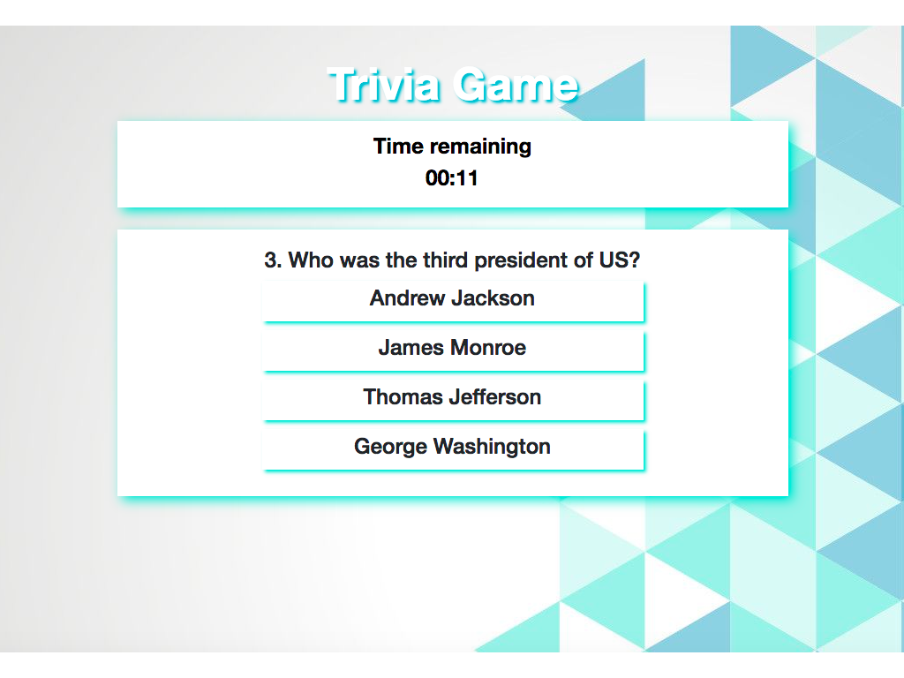

# Trivia-Timed

<!-- Put a description of what the project is -->
Learning jQuery: Click event handlers, setTimeOut, setInterval, dymanically creating html elements and adding them to the page

## Link to deployed site
<!-- make a link to the deployed site --> 
<!-- [What the user will see](the link to the deployed site) -->
[Trivia-Timed](https://ajitas.github.io/Trivia-Timed/)

## Images
<!-- take a picture of the image and add it into the readme  -->
<!--  -->


## technology used
<!-- make a list of technology used -->
<!-- what you used for this web app, like html css -->

<!-- 
1. First ordered list item
2. Another item
⋅⋅* Unordered sub-list. 
1. Actual numbers don't matter, just that it's a number
⋅⋅1. Ordered sub-list
4. And another item. 
-->
1. HTML
2. CSS/BootStrap
    * grid layout
    * box-shadow
    * text-shadow
3. Javascript
    * control structure
    * data structures
    * functions
4. jQuery
    * Event Handling
    * setTimeout/ clearTimeout
    * setInterval/ clearInterval
    * Dynamically creating new html elements
    * Appending and removing dynamically created html elements to other html elements
    * Providing attributes to dynamically created html elements
    * Displaying/Hiding elements with show()/hide()


## code snippets
<!-- put snippets of code inside ``` ``` so it will look like code -->
<!-- if you want to put blockquotes use a > -->

```
//data structure
var quiz = [
    {question:"Which is the deepest lake in US?",
    options:["Lake Michigan","Crater Lake","Lake Tahoe","Lake Clark"],
    answer:"Crater Lake",
    url:"https://upload.wikimedia.org/wikipedia/commons/5/5b/Wizard_Island%2C_Crater_Lake_01.jpg"},
    {question:"Which is the largest state in US?",
    options:["Alaska","California","New Mexico","Arizona"],
    answer:"Alaska",
    url:"https://upload.wikimedia.org/wikipedia/commons/e/e6/Flag_of_Alaska.svg"}
];

//shows the next question when the user answers current one or time is up
function showNextQuestion(){

    //reset timer for the next question
    currentTime = 20;

    //clear the previous interval
    clearInterval(updateTime);

    //clear the time div and show the new time
    $("#time-remaining > p").remove();
    $("#time-remaining").append("<p>" + timeConvert(currentTime)+"</p>");
    $("#time-remaining").css("color","black");

    //start running the timer
    updateTime = setInterval(decrementTime,1000);

    //clear the current question
    $("#question-area > div").remove();

    //make a new div for the next question
    var questionDiv = $("<div>");
    questionDiv.html("<h4>"+ parseInt(currentQuestion+1) + ". " +quiz[currentQuestion]["question"]+"</h4>");

    //show the new question div in the question-area
    $("#question-area").append(questionDiv);

    //for each of the four options
    for(var j =0; j<4 ;j++){

        //create a new div with id=option1,option2.. and add class options to it
        var optionDiv = $("<div>");
        optionDiv.attr("id", "option"+parseInt(j+1));
        optionDiv.attr("class", "options");

        //give value and text of the option to the newly created div
        optionDiv.val(quiz[currentQuestion]["options"][j]);
        optionDiv.html("<h4>"+quiz[currentQuestion]["options"][j]+"</h4>");
        
        //append it to the question-area after the question
        $("#question-area").append(optionDiv);

        //show the question area and hide the previous question's result
        $("#question-area").show();
        $("#result").hide();
    }
    $(".options").on("click", function(){
        //shows the result for the current question after clicking any option
        showResult($(this)[0].textContent);

    });
}

//shows result of the current question after clicking any option or when time is up
function showResult(currentUserAnswer){

    //stop the timer
    clearInterval(updateTime);

    //clear the last question's result
    $("#result").empty();

    //create a new for the result
    var resultDiv = $("<div>");

    //if user's answer is correct
    if(quiz[currentQuestion]["answer"] ===  currentUserAnswer){
        //increase the correct counter
        correct++;

        //show the result for the current question
        resultDiv.append("<p>Correct!</p>");
    }
    //if user didn't answer
    else if (!currentUserAnswer)
    {
        //increase the unanswered counter
        unanswered++;
        //show the result for the current question also show the correct answer
        resultDiv.append("<p>Time up!!</p>");
        resultDiv.append("<p>"+ "The correct answer was: " +quiz[currentQuestion]["answer"]+  "</p>");
    }
    //if user gave incorrect answer
    else{
        //increase the incorrect counter
        incorrect++;
        //show the result for the current question also show the correct answer
        resultDiv.append("<p>Oops!!</p>");
        resultDiv.append("<p>"+ "The correct answer was: " +quiz[currentQuestion]["answer"]+  "</p>");
    }
    var newImage = $("");
    newImage.attr("src",quiz[currentQuestion]["url"]);
    newImage.css("height","200px");
    newImage.css("width","200px");
    resultDiv.append(newImage);
    
    //append the new resultDiv to the result div
    $("#result").append(resultDiv);

     //hide the question area and show the result
    $("#question-area").hide()
    $("#result").show();

    //increase the question counter
    currentQuestion++;
    //if this is the last question
    if(currentQuestion === quiz.length){
        //show final evaluation after waiting for 2 second
        setTimeout(showFinalEvaluation,2000);
    }
    //if it is not the last question
    else{
        //show next question after 2 second
        setTimeout(showNextQuestion,2000);
    }
}
```
## Learning points
* Event Handling in jQuery
* Using setTimeout / clearTimeout
* Using setInterval / clearInterval
* Dynamically creating new html elements using jQuery
* Appending and removing dynamically created html elements to other html elements using jQuery
* Providing attributes to dynamically created html elements using jQuery
* Displaying/Hiding elements with show()/hide() jQuery


## Author 
[Ajita Srivastava](https://github.com/ajitas)

## License
Standard MIT License